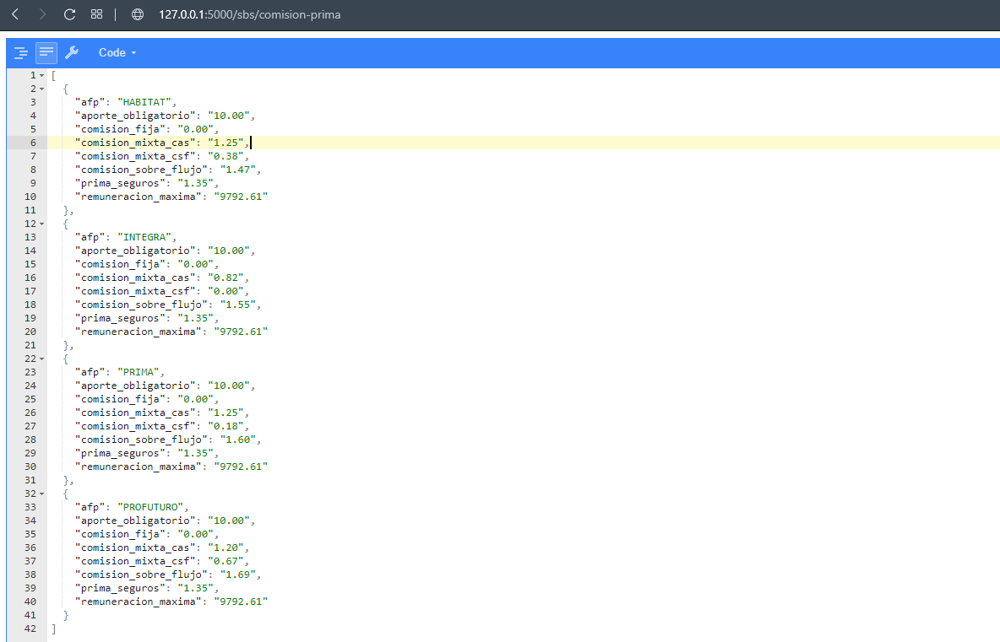

# Consulta Comisiones y Primas de Seguro del SPP

API que permite obtener la información de un periodo determinado.

Hace uso de Web Scrapping a la página de la SUNAT: 
https://www.sbs.gob.pe/app/spp/empleadores/comisiones_spp/Paginas/comision_prima.aspx

Ofrece las siguiente ventaja:
  - Permite obtener informacion en tiempo real


### Guia de uso
Esta API está desarrollada en usando las siguientes tecnologias:
  - Python 3.7 
  - Flask
  - BeautifulSoup

Instalar las depencias usando el siguiente comando:
```sh
pip install -r requirements.txt
```
Instalar **Tesseract** de la siguiente página y elegir el instalador de 32 bits o 64 bits (depende de la PC a ejecutar el API):
```sh
https://github.com/UB-Mannheim/tesseract/wiki
```
Despues de la instalación, configurar la ruta de donde se ha instalado **Tesseract** en el archivo config.py
Ejemplo:
```sh
TESSERACT_ROUTE = r'C:\Program Files\Tesseract-OCR\tesseract.exe'
```

Para empezar la aplicación usar:
```sh
flask run
```

Si se desea consultar la información de un periodo en específico:
```sh
http://127.0.0.1:5000/sbs/comision-prima?periodo=2020-07
```




